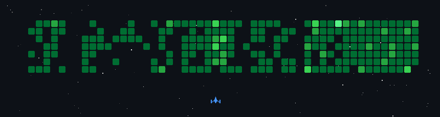

&nbsp;<em><strong>Talking about Personal Stuffs…</strong></em>

✔ I’m currently developing <strong>Hermina</strong> 
✔ I’m constantly improving the skills above  
✔ I’m introducing myself to the mods community of some games that i like through <a href="https://mod.io/g/readyornot/u/moonxd"><strong>Mod.io</strong></a> and  <a href="https://next.nexusmods.com/profile/derekoob/mods"><strong>Nexus Mods</strong></a>   
✔ I’m happy to collaborate with any <strong>Open - Source contribution</strong> 
✔ Ask me about anything, I am happy to help and also learn new things  

 

